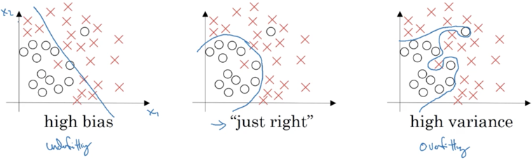
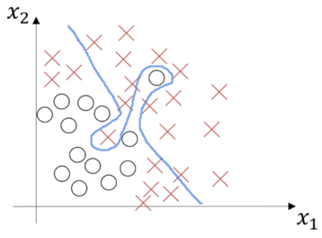

# 

# Improving Deep Neural Networks: Hyperparameter tuning, Regularization and Optimization

This is the second course of the deep learning specialization at [Cousera](https://www.coursera.org/specializations/deep-learning) which is moderated by [DeepLearning.ai](https://www.deeplearning.ai/).The course is taught by Andrew Ng.

## Course summary
Here are the course summary as its given on the course [link](https://www.coursera.org/learn/deep-neural-network):
> This course will teach you the "magic" of getting deep learning to work well. Rather than the deep learning process being a black box, you will understand what drives performance, and be able to more systematically get good results. You will also learn TensorFlow.

> After 3 weeks, you will: 
> - Understand industry best-practices for building deep learning applications.
> - Be able to effectively use the common neural network "tricks", including initialization, L2 and dropout regularization, Batch normalization, gradient checking
> - Be able to implement and apply a variety of optimization algorithms, such as mini-batch gradient descent, Momentum, RMSprop and Adam, and check for their convergence
> - Understand new best-practices for the deep learning era of how to set up train/dev/test sets and analyze bias/variance
> - Be able to implement a neural network in TensorFlow
> This is the second course of the Deep Learning Specialization.

## Week 1.Practical aspects of Deep Learning
> hyperparameter tuning 
> set up data
> optimization algorithm runs quickly

### Train/Dev/Test sets
* In practice apply machine learning is a highly iterative process. So go around the cycle: `Idea => Code => Experiment`, you have to go through the loop many times to figure out your hyperparameters.
* Data will be split into three parts:
    * Training set. (Has to be the largest set)
    * Hold-out cross validation set/Development or "dev" set
    * Testing set
* You will try to build a model upon training set then try to optimize hyperparameters on dev set as much as possible. Then after your model is ready you try and evaluate the testing set.
* So the trend on the ratio of splitting the models:
    * [100, 1000000) : 60/20/20
    * [1000000, INF) : 98/1/1 or 99.5/0.25/0.25
* Rule of thumb : make sure dev and test sets come from the same distribution.
    * For example if cat training pictures are from the web and the dev/test pictures are from users cell phone they will mismatch. It is better to make sure that dev and test set are from the same distribution.
* Its OK to only have a dev set without a testing set. But a lot of people in this case call the dev set as the test set. A better terminology is to call it a dev set as its used in the development.

### Bias / Variance
* Bias/Variance concept is easy to learn, but difficult to master.
* In Deep learning era, we just talk less about the bias-variance trade-off, but still talk about bias and variance.
* So some explanation here of Bias/Variance
    * If model underfits training data (logistic regression of non linear data) it has a "high bias"
    * If model overfits training data then it has a "high variance"

         


* In high dimensional problems which you can't plot the data and visualize division boundary. Instead, there are couple of different metrics to understand bias and variance
* Two key numbers to look at to understand bias and variance will be
    * Train set error
    * Dev set error

| Train set error | 1%  | 15% | 15% | 0.5% |
| --- | --- | --- | --- | --- |
| Dev set error | 11% | 16% | 30% | 1% |
|  | High variance | High bias | High bias & high variance | low bias & low variance |

* The table above is under the assumption : 
    * the base (human/optional) error is quite small
    * training and dev sets are drawn from the same distribution
* high bias & high variance look like:
  
    

### Basic Recipe for Machine Learning
* High bias ? (diagnosed by training set performance), if so, try to:
    * make NN bigger (more hidden layers, more hidden units)
    * run trains longer (iterative times)
    * some more advanced optimization algorithms
    * find new NN architecture that's better suited for the problem (maybe work, maybe not)
* High variance ? (diagnosed by dev set performance), if so, try to:
    * get more data
    * regularization
    * find new NN architecture that's better suited for the problem (maybe work, maybe not)
* In the earlier era of machine learning, there used to be a lot of discussion on "bias variance tradeoff".But in the modern deep learning, big data era, so long as you can keep training a bigger network almost always just reduce bias without necessarily hurting variance, or so long as  you can keep getting more data always reduce variance doesn't hurt bias much. 
* Training a bigger NN never hurts(the cost is just computational time).

### Regularization
* Aim : Adding regularization to NN will help it reduce variance (overfitting training data) 
* Vector norm 
    * L1 norm : ${\left\| W \right\|_1} = \sum\limits_{j = 1}^{{n_x}} {\left| {{W_j}} \right|} $
    * L2 norm : $\left\| W \right\|_2^2 = \sum\limits_{j = 1}^{{n_x}} {W_j^2} = {W^T}W$
* Regularization for Logistic regression
    * The normal cost function that we want to minimize is: $J(\omega ,b) = {1 \over m}\sum\limits_{i = 1}^m {L({{\hat y}^{(i)}},{y^i})} $
    * L1 regularization version : $J(\omega ,b) = {1 \over m}\sum\limits_{i = 1}^m {L({{\hat y}^{(i)}},{y^i}) + {\lambda  \over {2m}}} {\left\| W \right\|_1}$
    * L2 regularization version : $J(\omega ,b) = {1 \over m}\sum\limits_{i = 1}^m {L({{\hat y}^{(i)}},{y^i}) + {\lambda  \over {2m}}} \left\| W \right\|_2^2$
    * $\lambda$ is the regularization parameter(hyperparameter)
    * L2 regularization is used much more often, L1 regularization makes model sparse(a lot of w values become zeros) which makes the model size smaller.

* Regularization for NN
    * Frobenius norm of matrix : $\left\| W^{\left[ l \right]} \right\|_F^2 = \sum\limits_{i = 1}^{{n^{\left[ {l - 1} \right]}}} {\sum\limits_{j = 1}^{{n^{\left[ l \right]}}} {{{(w_{ij}^{\left[ l \right]})}^2}} } $ 
    , note that ${W^{\left[ l \right]}}:({n^{\left[ l \right]}},{n^{\left[ {l - 1} \right]}})$, F norm just. means the sum of square of elements of a matrix
    * The normal cost function that we want to minimize is : $J({\omega ^{[1]}},{b^{[1]}},...,{\omega ^{[L]}},{b^{[L]}}) = {1 \over m}\sum\limits_{i = 1}^m {L({{\hat y}^{(i)}},{y^i})} $
    * The regularization version : $J({\omega ^{[1]}},{b^{[1]}},...,{\omega ^L},{b^{[L]}}) = {1 \over m}\sum\limits_{i = 1}^m {L({{\hat y}^{(i)}},{y^i}) + {\lambda  \over {2m}}\sum\limits_{l = 1}^L {\left\| {{W^{[l]}}} \right\|_F^2} } $ 
    * Back-propagation & weight update (note that $d{W^{[l]}} = {{\partial J} \over {\partial {W^{[l]}}}}$)
        * Old way without regularization : $$d{W^{[l]}} = (from{\rm{ }}backprop)$$   $${W^{[l]}} = {W^{[l]}} - \partial d{W^{[l]}}$$
        * The update with regularization : $$d{W^{[l]}} = (from{\rm{ }}backprop) + {\lambda  \over m}{W^{[l]}}$$  $${W^{[l]}} = {W^{[l]}} - \partial \left[ {(from{\rm{ }}backprop) + {\lambda  \over m}{W^{[l]}}} \right] = {W^{[l]}} - {{\partial \lambda } \over m}{W^{[l]}} - \partial (from{\rm{ }}backprop)$$ 
    `so alternative name for L2 regularization is weight decay`

### Why regularization reduces overfitting?
Here are some intuitions:

* Intuition 1:
    * if $\lambda$ is too large - a lot of weights will          be close to zeros which will make the NN simpler as if it would behave closer to logistic regression.
    * if $\lambda$ is good enough it will just reduce some weights that makes the NN overfit
* Intuition 2:
    * if $\lambda$ is too large,  w's will be small (close to zero) - will use the linear part of the tanh activation function which would make the NN a roughly linear classifier.
    * if $\lambda$ is good enough it will just make some of tanh activations roughly linear which will prevent overfitting.
    
**Implementation tip** : if you f you implement gradient descent, one of the steps to debug gradient descent is to plot the cost function J as a function of the number of iterations of gradient descent and you want to see that the cost function J decreases monotonically after every elevation of gradient descent with regularization. If you plot the old definition of J (without implanting regularization) then you might not see it decrease monotonically.

### Dropout Regularization
* The dropout regularization eliminates some neurons/weights on each iteration based on a probability.
* A most common technique to implement dropout is called "Inverted dropout".
* Code for inverted dropout:
   ```python
   # Illustrate with layer l=3
   # d3 is the dropout vector for layer 3
   keep_prob = 0.8
   d3 = np.random.rand(a3.shape[0], a3.shape[1]) < keep_prob 
   # d3 is a boolea array, but the multiply operation works and will interpret the true and false values as one and zero
   a3 = np.multiply(a3, d3) # or a3 = a3 * d3
   
   a3 /= keep_prob # is called the inverted dropout technique
   # This equation increase a3 in order to not reduce the expected value of output(z[4])
   # (ensures that the expected value of a3 remains the same) - this makes test time easier because you have less of a scaling problem
   ```

* Vector d[l] is used for forward and back propagation and is the same for them, but it is different for each iteration (pass) or training example.
* At test time we don't use dropout. If you implement dropout at test time - it would add noise to predictions.

### Understanding Dropout

* In the previous video, the intuition was that dropout randomly knocks out units in your network. So it's as if on every iteration you're working with a smaller NN, and so using a smaller NN seems like it should have a regularizing effect.
* Another intuition: can't rely on any one feature, so have to spread out weights.
* It's possible to show that dropout has a similar effect to L2 regularization.
* Dropout can have different `keep_prob` per layer.
* The input layer dropout has to be near 1 (or 1 - no dropout) because you don't want to eliminate a lot of features.
* If you're more worried about some layers overfitting than others, you can set a lower `keep_prob` for some layers than others. The downside is, this gives you even more hyperparameters to search for using cross-validation. _**(The downside is quite a hand intuition for me to understand, //TODO)**_One other alternative might be to have some layers where you apply dropout and some layers where you don't apply dropout and then just have one hyperparameter, which is a `keep_prob` for the layers for which you do apply dropouts.

* A lot of researchers are using dropout with Computer Vision (CV) because they have a very big input size and almost never have enough data, so overfitting is the usual problem. And dropout is a regularization technique to prevent overfitting.
* A downside of dropout is that the cost function J is not well defined and it will be hard to debug (plot J by iteration).
  * To solve that need to turn off dropout, set all the `keep_prob`s to 1, and then run the code and check that it monotonically decreases J and then turn on the dropouts again.

### Other regularization methods

* **Data augmentation** :

  * For example in a computer vision data:
    * You can flip all your pictures horizontally this will give you m more brand new data instances.
    * You could also apply a distortion to get more data.

  * For example in OCR, you can impose random rotations and distortions to digits/letters.
  * New data obtained using this technique isn't as good as the real independent data, but still can be used as a regularization technique.

* **Early stopping** :

  * In this technique we plot the training set and the dev set cost together for each iteration. At some iteration the dev set cost will stop decreasing and will start increasing.

  * We will pick the point at which the training set error and dev set error are best (lowest training cost with lowest dev cost).We will take these parameters as the best parameters.

  * Andrew prefers to use L2 regularization instead of early stopping because this technique simultaneously tries to minimize the cost function and not to overfit which contradicts the **`orthogonalization`** principle (will be discussed further).

  * But its advantage is that you don't need to search a hyperparameter like in other regularization approaches (like `$lambda$` in L2 regularization).

  * Some tools to optimize cost function J : gradiant descent, momentum, RMS prop, Atom.

    Some tools not to overfit : regularization, getting more data.